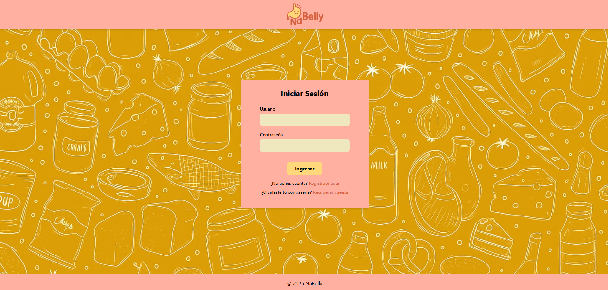
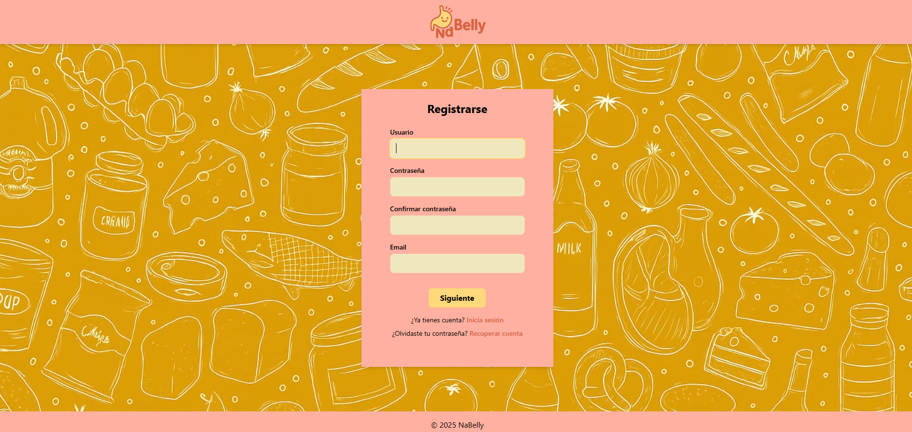
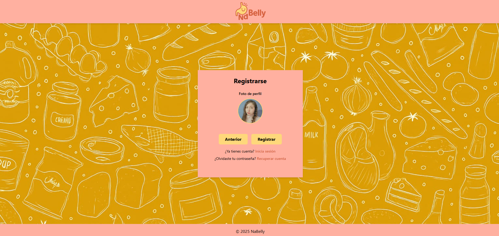
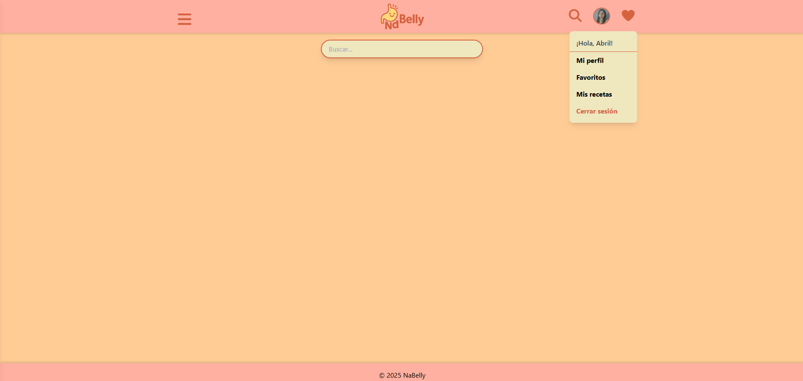
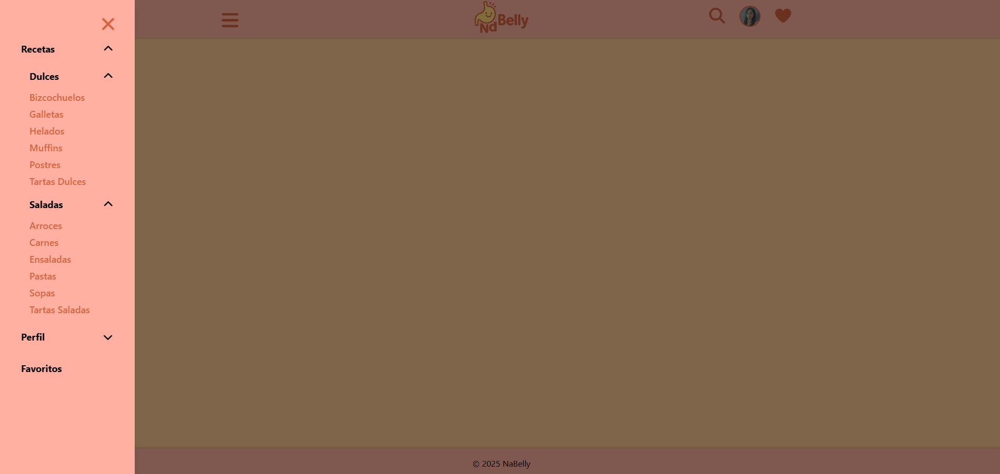
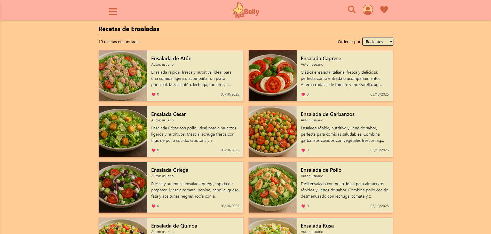

# NaBelly 🥨

## Stack

### Backend
- **Java JDK:** 21
- **Spring Boot:** 3.5.5
- **Spring Security**
- **JPA Repository**
- **JWT:** 0.11.5
- **BCrypt**
- **MySQL:** 8.0

### Frontend
- **Angular:** 20.2.3
- **TypeScript:** 5.9.2
- **Tailwind CSS:** 3.3.3

# 📸 Algunas imágenes del proyecto

  
  

  
  

  
  

  
  

